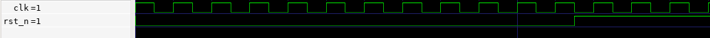
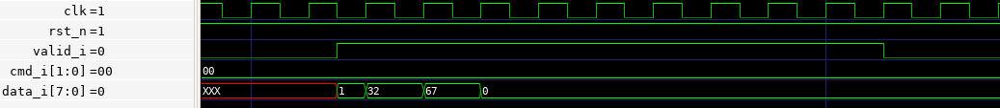
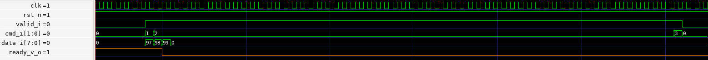
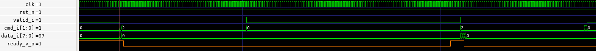
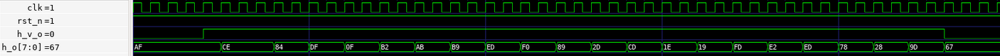
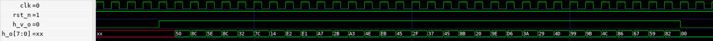

# Blake2s

This ASIC is a hashing accelerator for the Blake2 cryptographic hash function (RFC 7693).

It is a fully featured Blake2s implementation supporting both block streaming and using a secret key, with a maximum hash rate of 41.42 MB/s and a 
target frequency of 66 MHz.

## Blake2s Algorithm

Blake2 is a cryptographic hash function used for applications such as digital signatures, integrity protection and message authentication. It comes in 2 variants, Blake2b and the less memory intensive Blake2s.

|                 |    BLAKE2s       |
|-----------------|------------------|
| Block bytes     | bb = 64          |
| Hash bytes      | 1 <= nn <= 32    |
| Key bytes       | 0 <= kk <= 32    |
| Input bytes     | 0 <= ll < 2**64  |
              
In Blake2s, data is processed in blocks of $bb = 64$ bytes, where each block is run through a compression function for multiple rounds of mixing operations. 

Each Blake2s run can be configured with specific values for $kk$, $nn$, and $ll$. 

The parameter $kk$ represents the optional key length in bytes ($[0;32]$), where $kk = 0$ means keyless hashing and $kk > 0$ enables keyed mode. 

$nn$ specifies the output hash size in bytes ($[1;32]$), while $ll$ denotes the total input message length in bytes (up to $2^{64}-1$). 

After processing all input data blocks, the final state is truncated to $nn$ bytes to produce the hash output.

## Usage

The typical sequence to offload the hashing operation to the accelerator would go as follows:
1. Reset the accelerator (necessary on init)
2. Configure the hash parameters $kk$, $nn$, $ll$ (can be reused once configured)
3. Stream the input data by blocks of 64 bytes
4. Read the hash result

All data exchanges with the accelerator are in little endian, and when sending multiple-byte-long arrays, the lower indexes are sent first.

Notes:
- Empty data transfer cycles, as in one or more clock cycles where `data_v_i` would go low in the middle of the transfer of both the input data and the configuration, are supported.
### Reset

In order to reset this accelerator to its default uninitialized state, deassert the `rst_n` signal for at least 5 clock cycles. During normal operations, `rst_n` should be set to `1`.

During at least 5 clock cycles:
- `rst_n` is set to `0`

#### Example

Typical reset sequence:



### Sending the Configuration

The configuration packet is 10 bytes long and has the following format:
```
 Byte:   0        1        2        3        4        5        6        7        8        9
         +--------+--------+---------------------------------------------------------------+
         |   kk   |   nn   |                          ll                                   |
         +--------+--------+---------------------------------------------------------------+
```

$kk$ and $nn$ are both 8 bits wide, and $ll$ is 64 bits wide, and all use little endian.

Sending the configuration takes 10 data transfer cycles, during which:
- `valid_i` is set to `1`
- `cmd_i[1:0]` is set to `0`, indicating we are sending the configuration packet
- `data_i[7:0]` sends the next byte of the configuration packet

#### Example

In this example we are sending the following configuration:
- $kk = 1$ (1 Byte)
- $nn = 32$ (1 Byte) 
- $ll = 67$ (8 Bytes) 



#### Software

In the firmware, the `send_config` function defined in `data_wr_utils.h` is used to send a configuration to the accelerator.
```C
void send_config(uint8_t kk, uint8_t nn, uint64_t ll, uint dma_chan, pinout_t *p, size_t pl, PIO pio, uint sm);
```
Parameters : 
- `kk` configuration value, key length
- `nn` configuration value, final hash length in bytes
- `ll` configuration value, raw data length
- `dma_chan` is the DMA channel used to offload copying data between the memory and the RP2040's PIO
- `p` is a pointer to the shared pre-allocated pool of memory we can temporarily use to allocate the necessary `pinout_t`
- `pio` is the base address of the PIO where the data write program is running
- `sm` is the index of the PIO state machine where the data write program is running

### Sending Data

Just like in the original hashing algorithm, the stream of data to be hashed must first be padded with `0x00` to a multiple of 64 bytes, then starting from the lowest indexes first, blocks are sent one by one, one byte at a time.

The sequence to send a block is as follows:
- Wait for ASIC to set `ready_v_o` to `1`

Then, start the 64 data transfer cycles during which:
- `valid_i` is set to `1`
- `cmd_i[1:0]` is set to :
  - `1` if this is the first data transfer cycle of the first block
  - `3` if this is the last data transfer cycle of the last block
  - `2` by default
- `data_i[7:0]` contains the current data byte

The `ready_v_o` signal indicates the accelerator is ready to receive data. In order to improve performance, users can skip waiting for this signal to be re-asserted between each byte transfer and can safely proceed with sending the entire block as soon as the `ready_v_o` signal is observed at `1`.

⚠️ Critical Timing Requirement: When using the optimization, since it takes 2 clock cycles for the new value of `ready_v_o` to be written on the output pin, users must guarantee at least a 30ns gap (for 66MHz) between the end of the previous block write and the evaluation of the next `ready_v_o` signal. The current firmware guarantees such a gap.

#### Single Block Example

This is an example of a simple data transfer sequence where the entirety of the data fits within a single block.

Given there is a single block, meaning it is both the first and last block, the `mode_i` control bits are set to `1` on the first cycle and `3` on the last cycle.



#### Multi-Block Example

In this example we are sending two blocks of data.

This example shows the data transfer associated with the configuration waves used as an example above ($kk = 1, nn = 32, ll = 67$).

The first block contains the key of size $kk = 1$ byte, the key's contents are 'a' and padded with `0x00` up to 64 bytes.

After the first block has finished sending, we wait until the accelerator asserts the `ready_v_o` signal before starting the second transfer.

The second block contains the $ll - (kk>0?64:0)$, here 3, bytes of data "abc", again padded with `0x00` until 64 bytes.



#### Software 

In the firmware, for sending data to the accelerator we use the `send_data` function defined in the `data_wr_utils.h` header.
```C
void send_data(uint8_t *data, size_t dl, pinout_t *p, size_t pl, uint dma_chan, PIO pio, uint sm);
```
Parameters : 
- `data` is a pointer to the raw data (not extended to a multiple of 64 bytes) to be hashed
- `dl` is the `data` length in bytes
- `p` is a pointer to the shared pre-allocated pool of memory we can temporarily use to allocate the necessary `pinout_t`
- `dma_chan` is the DMA channel used to offload copying data between the memory and the RP2040's PIO
- `pio` is the base address of the PIO where the data write program is running
- `sm` is the index of the PIO state machine where the data write program is running

### Slow Output Mode

For the `sky130b` shuttle, although the maximum stable GPIO input switching frequency is 66 MHz, due to a weak driver on the output buffer path resulting in much higher slew rate, the current maximum output stable supported transitioning frequency is 33 MHz. 

In order to allow more room for experimenting with the limits of the maximum stable output switching rate while supporting a more stable operating mode, the "slow output" mode was added to this design.

⚠️ Users simply looking to reliably use the accelerator should always have the slow output mode set.

This mode can be enabled by setting `output_mode_i[1:0]` at any time while the accelerator is hashing or receiving data, but for more reliability, we recommend the user simply clamp these pins using the GPIO.

Setting the slow output mode:
- `output_mode_i[1:0]` is set to `3`

Setting the default fast output mode:
- `output_mode_i[1:0]` is set to `0`

### Reading the Hash

After the accelerator finishes hashing the last block, it will begin streaming out the final hash result.

In Blake2, the $nn$ configuration parameter specifies how many bytes long the resulting hash should be. This accelerator follows this convention and will only return $nn$ bytes as a result.

Since this accelerator was designed to interface with an embedded MCU and not another accelerator or an FPGA, the accelerator asserts the `hash_v_o` signal ahead of starting to stream out the result. This is done so that we can allow the RP2040 PIO to detect the start of the result sequence and initiate capturing the data. Because of this, this accelerator is tightly co-designed with the RP2040 in mind and cannot be ported to other MCU families, as it is reliant on a 15ns/30ns (if slow mode is set) reaction time, followed by very timing-accurate capture of the GPIO values. See `firmware/data_rd.pio` for this PIO assembly program.

If slow output mode is set (see [above](#slow-output-mode)), all data steps in the data output sequence take 2 clock cycles; otherwise, each step takes 1 cycle.

The hash read sequence has 2 parts:
1. `h_v_o` (`hash_v_o`) is set to `1` for 1 step (1/2 clock cycles) in order to let the PIO initiate data capture
2. The hash result is streamed over $nn$ steps:
   - `h_v_o` (`hash_valid_o`) is set to `1`
   - `h_o` (`hash_o[7:0]`) contains the hash result
  
 #### Example Hash result in slow output mode

In this example, slow output mode is set, and the accelerator is returning a hash result of $nn = 32$  bytes long. 

 

 #### Example Hash result in fast output mode 

In this example, the defatul fast output mode is used, and the accelerator is returning a hash result of $nn = 32$  bytes long. 

 

#### Software 

In order to capture this hash result, given the high-speed nature of the transfer and the precision needed in the capture, the entire capture sequence is offloaded to the PIO. Additionally, since, depending on the configured $nn$, the PIO RX FIFO (internal rx buffer) might be too small to store all of the hash result, a DMA stream is set up to automatically transfer RX FIFO entries to memory.

Given there is only on the order of 1.5µs between the last data transfer cycle of the last block and the start of the hash result, and given this is not remotely enough time for our MCU to reliably set up a new data capture, the hash result read must be set up before the last data transfer cycle. In practice, in the firmware we use `setup_rd_dma_hash_stream` to set up this DMA stream before the start of any input data streaming, see `firmware/main.c`.

Unlike the input data streaming from the MCU to the accelerator, the hash result is a gapless stream where data is transferred at every step. As such, it is very important that the MCU be able to stream uninterrupted without dropping any of the result bytes. Because of this, the DMA stream between the PIO SM used for reading and the memory is set up to be of the highest priority.

Set up DMA stream to capture the hash result, part of `data_rd_utils.h`:
```C
void setup_rd_dma_hash_stream(uint dma_chan, uint nn, uint8_t* buffer, size_t bl, PIO pio, uint sm);
```

Parameters:
- `dma_chan` - high priority DMA channel used to read from the PIO SM to memory
- `nn` - hash result length in bytes
- `buffer` - pointer to the target location in memory the DMA should write to
- `bl` - buffer length in bytes
- `pio` - base address of the PIO performing the hash read operation
- `sm` - index of the PIO state machine currently running with the hash read program

Given all the reading and transfer operations were already handled under the hood by the PIO and DMA, the `read_hash` function only needs to wait for the end of the DMA transfer operations and copy the hash result written by the DMA into the `hash` buffer.

Read the hash result from the DMA target memory location, part of `data_rd_utils.h`:
```C
void read_hash(uint8_t* hash, uint8_t nn, uint8_t* buffer, size_t bl, uint dma_chan);
```

Parameters:
- `hash` - pointer to the buffer to which the hash result will be copied
- `nn` - hash result length in bytes
- `buffer` - pointer to the target location in memory the DMA should write to
- `bl` - buffer length in bytes
- `dma_chan` - high priority DMA channel used to read from the PIO SM to memory
