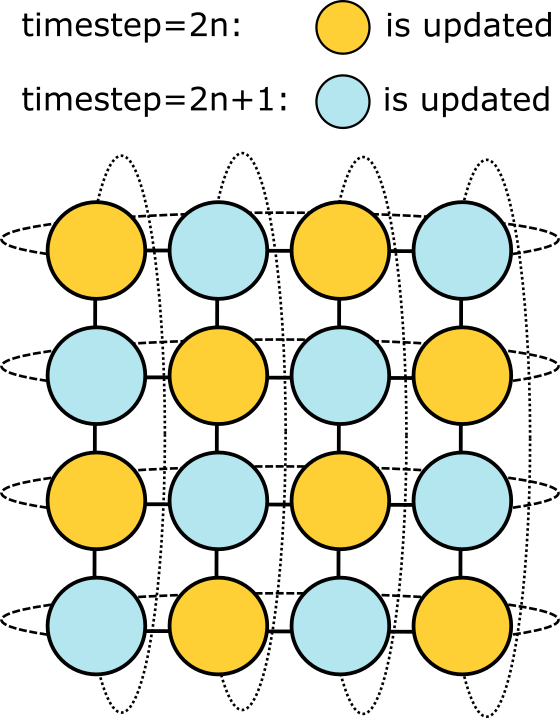

<!---

This file is used to generate your project datasheet. Please fill in the information below and delete any unused
sections.

You can also include images in this folder and reference them in the markdown. Each image must be less than
512 kb in size, and the combined size of all images must be less than 1 MB.
-->

## How it works

The neurons are imagined to be arranged in a 4 × 4 grid, with each neuron connected to its four neighboring neurons.  
In reality, neurons [0, 0] and [3, 0] cannot be physically connected, but here it is assumed that they are connected.

At each time step, the state of each neuron is updated based on the input value and the states of its neighbors.

The network structure described above is shown in the figure below.

Here, the yellow neurons represent **odd neurons**, and the blue neurons represent **even neurons**, as mentioned in the pin explanation.  
Odd and even neurons are updated alternately, following a checkerboard pattern.

The inputs, states, and weights are all **8-bit**, which might reduce accuracy.  
Moreover, the absence of a nonlinear transformation (e.g., _tanh_) might further degrade performance, making it different from the original reservoir computing.

## How to test

Simulation was originally conducted using Julia.  
The given inputs and the corresponding ideal outputs are provided as text files.  
The test bench checks whether the circuit reproduces these results.

## External hardware

A PCB board is sufficient.
