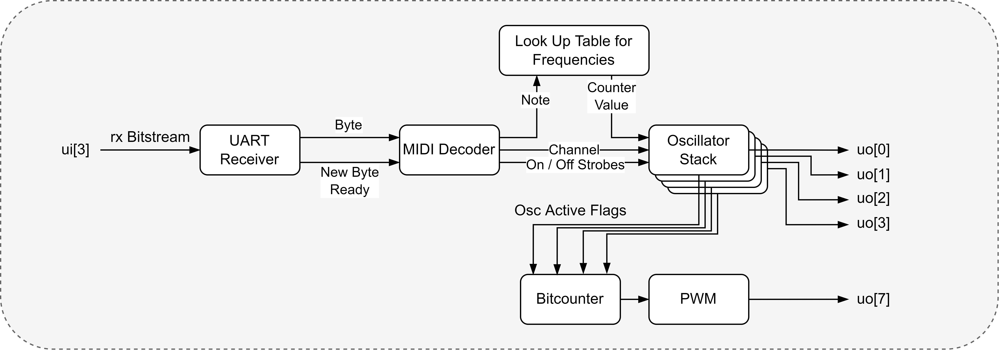

# Polyphonic MIDI Synthesizer ASIC

## How it works

The Project generates **Square Waves** based on a MIDI note recieved on the input Pin. The oscillator stack is capable of synthesizing up to 4 voices simultaneously. Each voice is routed to a different output pin, allowing for external mixing of the signals. Each Oscillator responds to a **different MIDI-Channel**, which is necessary to simplify the voice allocation logic inside the ASIC. Additionally, a PWM signal is provided on a separate output pin, which encodes the number of currently active voices in its duty cycle. This PWM signal can be used to control the gain of the mixed output through lowpass filtering.

The number of voices is constrained by the available area. If further optimizations can be applied or another tile is added, you can change the number of voices by updating the `OSC_VOICES` parameter in [`src/global.v`](/src/global.v) and see if the area is sufficient after regenerating the GDS.

### How the MIDI protocol works

MIDI (Musical Instrument Digital Interface) is a technical standard that describes a protocol, digital interface, and connectors for connecting various electronic musical instruments and computers together.

MIDI messages are transmitted as a series of bytes. Each message typically consists of a status byte followed by one or more data bytes. The status byte indicates the type of message and the MIDI channel it is associated with, while the data bytes contain additional information such as note number and velocity.

More on MIDI messages can be found [here](https://www.midi.org/specifications-old/item/table-1-summary-of-midi-message).

### How the ASIC responds to Edge Cases

If a second note ON command is received for a voice that is already active, the ASIC will output the new frequency on the same output pin, effectively overriding the previous note. Releasing the previous note will not stop the sound. Only when the note OFF command of the currently active note is received, the oscillator will stop. This behaviour is called voice stealing.

If a channel is recieved outside of the voice range the behavior is as follows: Overflowing channels will eventually loop around when surpassing the size of the channel register. All inputs inbetween the max number of voices and the register size will be ignored.

The ASIC only responds to Note ON and Note OFF commands. Other MIDI commands such as Control Change, Pitch Bend etc. may result in undefined behavior.

The ASIC always expects 3 bytes per MIDI message. If the UART receiver gets out of sync, it may interpret random data as valid MIDI messages.

### How to generate MIDI messages

There are multiple ways to feed the ASIC with MIDI messages:

1. Use a Microcontroller to Emulate a MIDI device. This is the easiest way to get started. You can use an e.g. the onboard RP2040 or any other microcontroller with UART capabilities.
2. Use a MIDI Controller (Piano, Pads) with a native MIDI-OUT DIN connector. You will need a PMOD as a physical layer to convert the differential signal to a single-ended UART signal.
3. Use a Computer to send MIDI Messages via a USB serial interface. You can use the RP2040 or an FTDI Chip and send raw MIDI messages over a serial connection.
4. If you have a Digital Audio Workstation (DAW) available, you can send MIDI messages from virtual instruments inside the DAW to a virtual MIDI Port.

Here are some software recommendations for option 4:

- Create a virtual MIDI Port on your Computer with [loopMIDI](https://www.tobias-erichsen.de/software/loopmidi.html) by Tobias Erichsen (Free for personal use)
- Connect a virtual MIDI interface to a COM-Port with [Hairless MIDI Serial](https://projectgus.github.io/hairless-midiserial/) (FOSS under GPLv2)
- Digital Audio Workstations:
  - [LMMS](https://lmms.io/) (FOSS under GPLv2)
  - [Ableton Live](https://www.ableton.com/en/live/) (Proprietary, Paid)

### Internal Structure

## How to test

To test the ASIC, feed it with Note-On-MIDI messages with one of the methods above. Observe the signals present on the output with an oscilloscope or logic analyzer. You should see square waves on the output pins corresponding to the notes played on the MIDI controller or sent from the DAW. Additionally, you can monitor the PWM output on pin 7 to see the number of active voices.

## External hardware

In the simplest setup, a speaker with a driver circuit can be connected to an output pin to hear the synthesized audio.

- MIDI Source (MIDI Controller, DAW, Microcontroller)
- (Optional) External Mixing circuitry to combine the output signals from the oscillator outputs.
- Speaker with a driver
